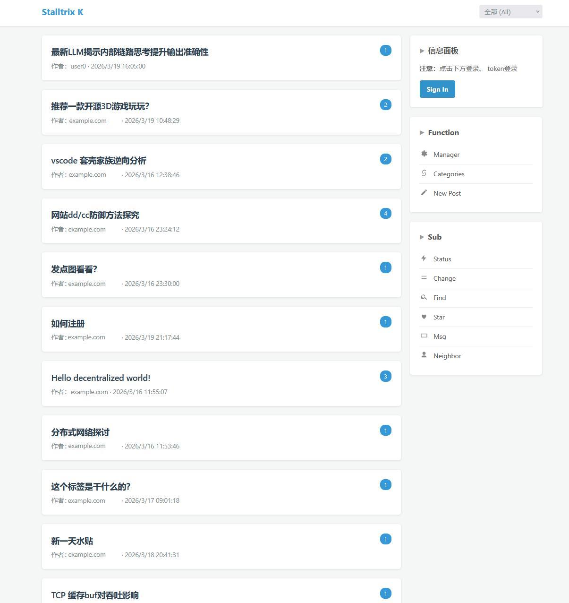

# kepweb

kep webUI 界面，取代默认的kepcli，实现发帖/回帖/修改 webUI化

配置方法：

neighbors指向自己的阶段，token填local_token
```json
"neighbors": [
		{
			"url": "http://127.0.0.1:8081",
			"token": "token0"
		}
	]
```


与kepcli的发送指令差不多
```bash
kepcli -act send -addr http://127.0.0.1:8081 -auth token0
```


kep实现有一个local_token，与普通token没用多大区别，唯一区别就是不会再把msg发回来，设计为local环境使用。

<br>

## 效果展示



---

<br>

## 安装教程

### 1.安装edge主程序

安装[kep-edge](https://github.com/stalltrix/kep-demo)项目，在相同目录安装并启动程序。配置api_token以及local_token，后续kepweb程序使用

### 2.安装kepweb程序

参考[config.json](config.json)进行配置文件。启动kepweb程序

config最小配置示例

```json
{
        "mainkey": "mainkey.pub",
        "pub_key": "pkey.pub",
        "priv_key": "pkey.priv",
        "sig_key": "pkey.sig",
		"ntp": "time.cloudflare.com",
        "domain": "[your domain]",
		"user":"[your username]",
        "login_token": "[your password]",
        "api_token": "[your kep-edge api_token]",
        "listen": "127.0.0.1:3000",
        "neighbors": [
                {
                        "url": "http://127.0.0.1:8080",
                        "token": "[your kep-edge local_token]"
                }
        ]
}
```

### 3.登录并使用

使用config.json所配置的用户名与密码登录，即可完成使用

---

<br>

## 提示:

此主题为单用户设计主题，如果需要多用户使用。可以参考[kepweb-multi](https://github.com/stalltrix/kepweb-multi)项目。

kepweb-multi与kepweb的后端接口API是相同的，理论上两者的前端主题（即：**ui.html**）是可以互相替换的（更改一下url重写路径就行）。

<br>

单用户主题资源占用低，开发进度快。如无特殊需求，使用单用户主题即可。